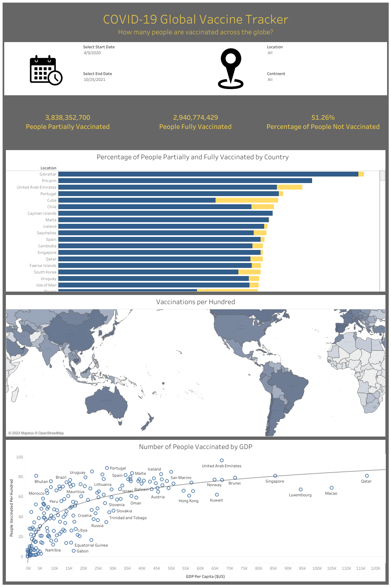

# COVID-19-Vaccine-Workbook
As a project in Tableau I created this workbook analyzing and visualizing COVID-19 Vaccination data from across the globe. This included the use of filters on both dates and locations. The workbook itself is included as well as a preview image of the project and the csv containing the data.

